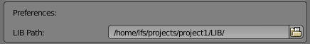
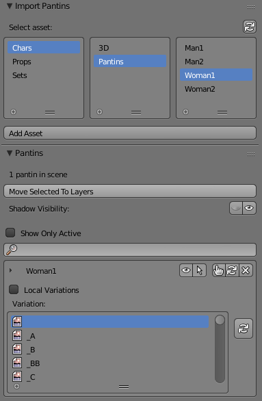
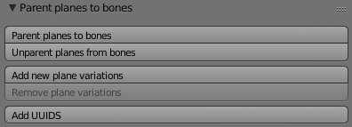

# Pantin Tools

Set of Blender tools for our cutout characters [Pantin in French].

<!-- TOC START min:1 max:3 link:true update:true -->
- [Pantin Tools](#pantin-tools)
  - [Import Pantin from LIB](#import-pantin-from-lib)
  - [Parent Planes to Bones](#parent-planes-to-bones)
- [License](#license)

<!-- TOC END -->

## Import Pantin from LIB
/!\ This script is written to work with our internal file structure right now, so it shouldn't work out of the box.

The `LIB Path` is used to select the directory containing the cutout characters, especially when multiple projects are involved.

Several tools are available to manipulate the cutout characters, including a system (variations) to switch textures on several objects at once, depending on a suffix in the corresponding image names.

---
## Parent Planes to Bones
This script is used to automatically parent planes imported from a Photoshop file using [2d animation tools](https://github.com/LesFeesSpeciales/2d_animation_tools) by [Jasper van Nieuwenhuizen](http://linesofjasper.com/), to bones sharing the same name in a cutout rig. In our workflow, this rig is in turn generated using [our modified version of Rigify](https://github.com/LesFeesSpeciales/rigify).

It is used at the rigging stage to :
* Parent image objects to DEF-ormation bones, as well as duplicating symmetrical members including legs and arms
* Add “*Plane variations*”, that is to say frames of animation for a particular image. For example, you'd draw several frames of a blink, and this tool sets it up so that you can control it with an animatable slider.
* Create UUIDs for each object. This is a hidden property which is used upon import into shots by the aforementioned tool, to differenciate characters.

-----

# License

Scripts contained in this repository are licensed under the GPLv2 license.
